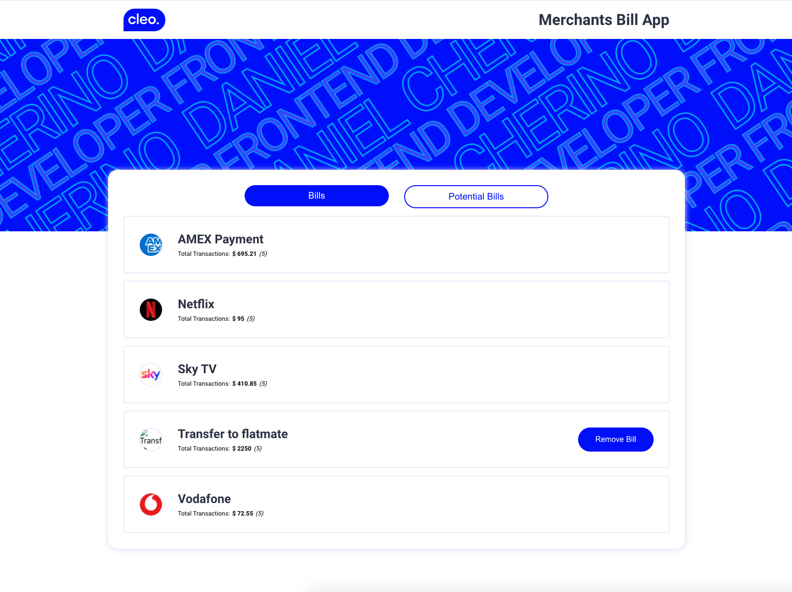

## Cleo Frontend Interview - Bills

A SWA React/TypeScript which displays a list of Bills

The technologies used to develop this project are:

* ReactJS
* TypeScript
* Redux Saga
* Styled Components

*Interview instructions have been moved [here](./docs/instructions.md)*

## Selected Option: Option 2

For this technical test, I decided to go for **Option 2** in order to work a bit more in the UI. Please, find bellow the time used for every aspect of the app development:

* Functionality without UI: ~4.5 h
* UI: ~4 h

Please, to find more about why I spend more time than the suggested originally for the functionality side, see the section [`Challenges`](#markdown-header-challenges)

## Comments

I would like to start saying that I'm very happy with the final result, specially with the design of the UI. I really enjoy doing my own designs.

Regarding with the development, I found this technical assigment very exciting as it has been a good opportunity to display a wide range of skills.
One of the most instersting thing has been working using Sagas. Personally, I have always used redux + thunks as my state management tool, but after working in this app, I can seen the advantages that sagas offer on big scales.

I would like to flag that as I was running out of time, I only added tests where I considered it was more relevant for this project. Normally, I would try to cover most of the app. Please, let me know if these are enough.

## Improvements

There are some improvements that I would like to do if I had more time to work on this application. These improvements are:

* Mobile version. It is not fully adapted for mobile version now, but should be very easy to do.
* Increase test coverage.

## Challenges

My biggest challenge for this project has been working with Sagas.
As I mentioned before under the Comments section, I normally work with thunks therefore I have to spend a little more of the estimated time reading documentation about how to use integrate it and how to test it. It has been a great experience and without no doubt, it will be a skill that I will develop further.

## Technical details

This project was bootstrapped with [Create React App](https://github.com/facebook/create-react-app).

In the project directory, you can run:

### `yarn start`

Runs the app in the development mode.
Open [http://localhost:3000](http://localhost:3000) to view it in the browser.

The page will reload if you make edits.
You will also see any lint errors in the console.

### `yarn test`

Launches the test runner in the interactive watch mode.
See the section about [running tests](https://facebook.github.io/create-react-app/docs/running-tests) for more information.

### `yarn build`

Builds the app for production to the `build` folder.
It correctly bundles React in production mode and optimizes the build for the best performance.

The build is minified and the filenames include the hashes.
Your app is ready to be deployed!

See the section about [deployment](https://facebook.github.io/create-react-app/docs/deployment) for more information.
